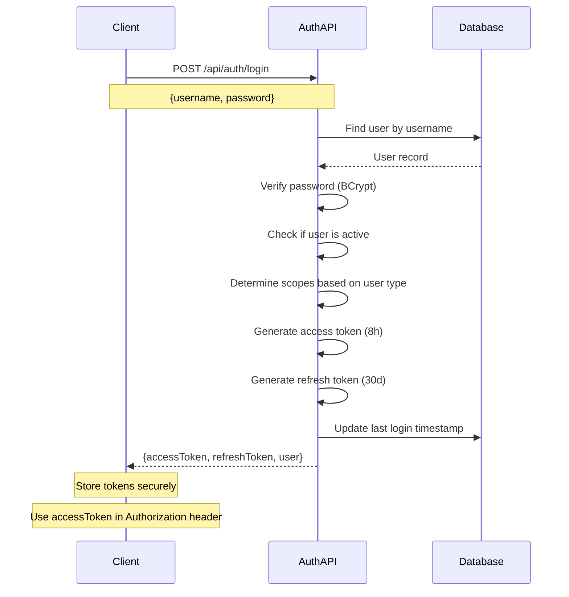
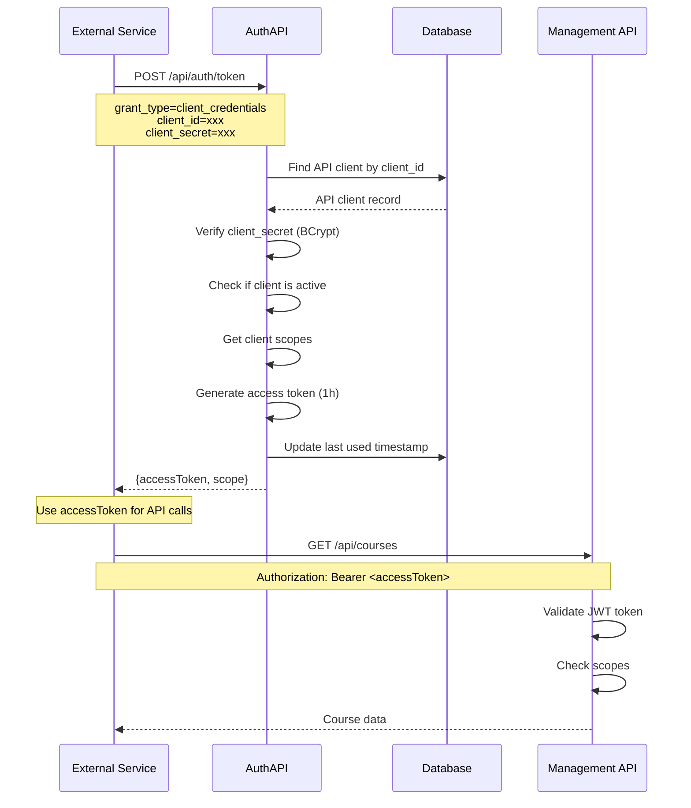
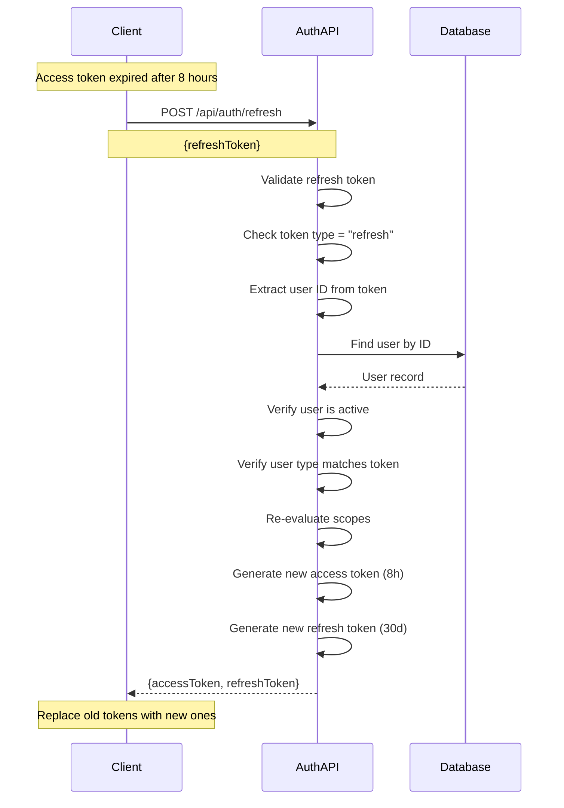
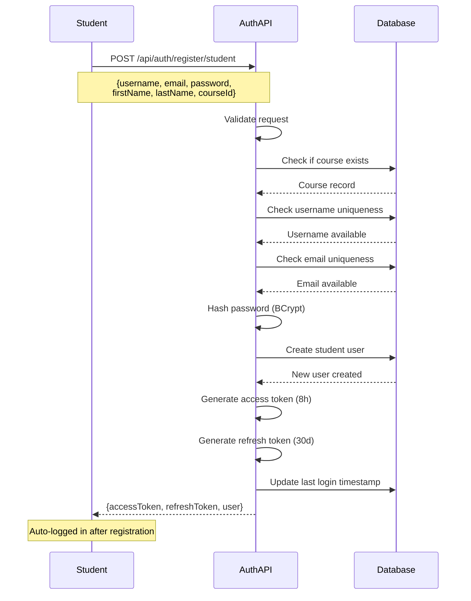
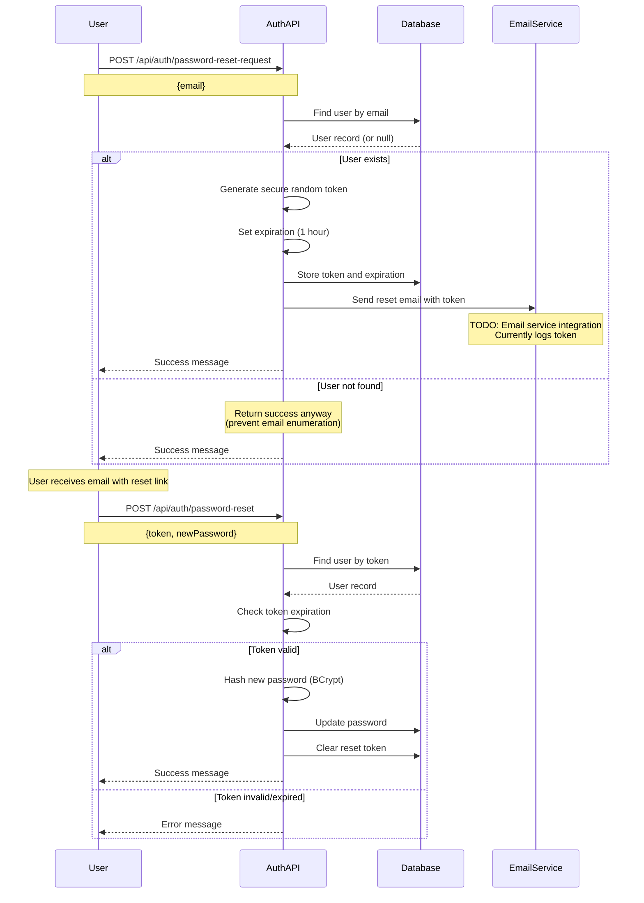
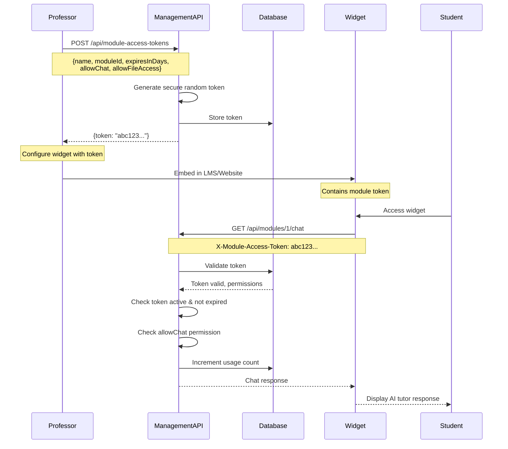

# Tutoria Authentication & Authorization Guide

Complete guide to understanding and implementing authentication and authorization in the Tutoria platform.

## Table of Contents

- [Overview](#overview)
- [Authentication Flows](#authentication-flows)
- [Authorization Model](#authorization-model)
- [Security Best Practices](#security-best-practices)
- [Integration Examples](#integration-examples)
- [Troubleshooting](#troubleshooting)

---

## Overview

Tutoria uses **JWT (JSON Web Tokens)** for stateless authentication across both APIs. The system supports multiple authentication flows for different use cases:

- **User Authentication**: Username/password login for professors, students, and super admins
- **API Client Authentication**: OAuth2 client credentials for server-to-server communication
- **Token Refresh**: Refresh expired access tokens without re-login
- **Module Access Tokens**: Secure tokens for widget/external integrations

### Key Concepts

- **Access Token**: Short-lived JWT (8 hours) for API authentication
- **Refresh Token**: Long-lived JWT (30 days) for obtaining new access tokens
- **Bearer Token**: Standard HTTP Authorization header format
- **JWT Claims**: Information embedded in tokens (user ID, type, scopes, etc.)

---

## Authentication Flows

### Flow 1: User Login (Username/Password)

This is the primary authentication method for human users (professors, students, super admins).



#### Request

```http
POST /api/auth/login HTTP/1.1
Host: localhost:5001
Content-Type: application/json

{
  "username": "professor1",
  "password": "SecurePass123!"
}
```

#### Response

```json
{
  "accessToken": "eyJhbGciOiJIUzI1NiIsInR5cCI6IkpXVCJ9.eyJzdWIiOiIxIiwidHlwZSI6InByb2Zlc3NvciIsInNjb3BlIjoiYXBpLnJlYWQgYXBpLndyaXRlIiwiaXNBZG1pbiI6InRydWUiLCJleHAiOjE3MzQxNzQwMDB9.signature",
  "refreshToken": "eyJhbGciOiJIUzI1NiIsInR5cCI6IkpXVCJ9.eyJzdWIiOiIxIiwidHlwZSI6InByb2Zlc3NvciIsInRva2VuX3R5cGUiOiJyZWZyZXNoIiwiZXhwIjoxNzM2NzY2MDAwfQ.signature",
  "tokenType": "Bearer",
  "expiresIn": 28800,
  "user": {
    "userId": 1,
    "username": "professor1",
    "email": "prof@university.edu",
    "firstName": "John",
    "lastName": "Doe",
    "userType": "professor",
    "isActive": true,
    "isAdmin": true
  }
}
```

#### JWT Access Token Claims

```json
{
  "sub": "1",                    // User ID
  "type": "professor",            // User type
  "scope": "api.read api.write",  // Permissions
  "isAdmin": "true",              // Admin status (professors only)
  "nbf": 1734145200,              // Not before timestamp
  "exp": 1734174000,              // Expiration timestamp (8 hours)
  "iss": "tutoria-auth-api",      // Issuer
  "aud": "tutoria-api"            // Audience
}
```

#### Scopes by User Type

| User Type | Scopes | Permissions |
|-----------|--------|-------------|
| `super_admin` | `api.read api.write api.admin` | Full system access |
| `professor` (admin) | `api.read api.write api.manage` | Course management |
| `professor` | `api.read api.write` | Module management |
| `student` | `api.read` | Read-only access |

---

### Flow 2: OAuth2 Client Credentials (API-to-API)

Used for server-to-server authentication when the Management API needs to authenticate with the Auth API, or when external services need API access.



#### Request

```http
POST /api/auth/token HTTP/1.1
Host: localhost:5001
Content-Type: application/x-www-form-urlencoded

grant_type=client_credentials&client_id=tutoria-management-api&client_secret=super-secret-key
```

#### Response

```json
{
  "accessToken": "eyJhbGciOiJIUzI1NiIsInR5cCI6IkpXVCJ9.eyJzdWIiOiJ0dXRvcmlhLW1hbmFnZW1lbnQtYXBpIiwidHlwZSI6ImNsaWVudCIsInNjb3BlIjoiYXBpLnJlYWQgYXBpLndyaXRlIGFwaS5hZG1pbiIsImV4cCI6MTczNDE0ODgwMH0.signature",
  "tokenType": "Bearer",
  "expiresIn": 3600,
  "scope": "api.read api.write api.admin"
}
```

#### Creating API Clients

API clients are created in the database (managed by super admins). The system seeds a default client in development:

```csharp
// DbSeederService.cs - creates default API client
new ApiClient
{
    ClientId = "tutoria-management-api",
    HashedSecret = BCrypt.Net.BCrypt.HashPassword("super-secret-key"),
    Name = "Tutoria Management API",
    Description = "Internal API client for Management API",
    Scopes = "[\"api.read\",\"api.write\",\"api.admin\"]",
    IsActive = true
}
```

---

### Flow 3: Token Refresh

Refresh tokens allow clients to obtain new access tokens without requiring the user to log in again. This is essential for maintaining long-running sessions.



#### Request

```http
POST /api/auth/refresh HTTP/1.1
Host: localhost:5001
Content-Type: application/json

{
  "refreshToken": "eyJhbGciOiJIUzI1NiIsInR5cCI6IkpXVCJ9.eyJzdWIiOiIxIiwidHlwZSI6InByb2Zlc3NvciIsInRva2VuX3R5cGUiOiJyZWZyZXNoIiwiZXhwIjoxNzM2NzY2MDAwfQ.signature"
}
```

#### Response

```json
{
  "accessToken": "eyJhbGciOiJIUzI1NiIsInR5cCI6IkpXVCJ9...",
  "refreshToken": "eyJhbGciOiJIUzI1NiIsInR5cCI6IkpXVCJ9...",
  "tokenType": "Bearer",
  "expiresIn": 28800
}
```

#### Implementation Best Practices

**Client-Side Token Refresh Logic**:

```javascript
// JavaScript example
let accessToken = localStorage.getItem('accessToken');
let refreshToken = localStorage.getItem('refreshToken');

async function apiRequest(url, options = {}) {
  // Add access token to request
  options.headers = {
    ...options.headers,
    'Authorization': `Bearer ${accessToken}`
  };

  let response = await fetch(url, options);

  // If 401 Unauthorized, try refreshing token
  if (response.status === 401) {
    const refreshResponse = await fetch('https://localhost:5001/api/auth/refresh', {
      method: 'POST',
      headers: { 'Content-Type': 'application/json' },
      body: JSON.stringify({ refreshToken })
    });

    if (refreshResponse.ok) {
      const data = await refreshResponse.json();
      accessToken = data.accessToken;
      refreshToken = data.refreshToken;

      // Store new tokens
      localStorage.setItem('accessToken', accessToken);
      localStorage.setItem('refreshToken', refreshToken);

      // Retry original request with new token
      options.headers['Authorization'] = `Bearer ${accessToken}`;
      response = await fetch(url, options);
    } else {
      // Refresh failed - redirect to login
      window.location.href = '/login';
    }
  }

  return response;
}
```

---

### Flow 4: Student Registration

Self-service registration for students. Returns tokens for immediate login after registration.



#### Request

```http
POST /api/auth/register/student HTTP/1.1
Host: localhost:5001
Content-Type: application/json

{
  "username": "student123",
  "email": "student@university.edu",
  "password": "SecurePass123!",
  "firstName": "Jane",
  "lastName": "Smith",
  "courseId": 1
}
```

#### Password Requirements

- Minimum 8 characters
- At least one uppercase letter
- At least one lowercase letter
- At least one number
- At least one special character

The `PasswordComplexityAttribute` validator enforces these rules.

---

### Flow 5: Password Reset

Secure password reset flow with time-limited tokens.



#### Security Features

1. **Anti-Enumeration**: Always returns success message, even if email doesn't exist
2. **Secure Token Generation**: 32 random bytes, Base64 encoded
3. **Time-Limited**: Tokens expire after 1 hour
4. **Single-Use**: Token is cleared after successful reset

---

### Flow 6: Module Access Tokens (Widget Integration)

Special tokens for embedding AI tutors in external applications (LMS widgets, mobile apps, etc.).



#### Creating Module Access Token

```http
POST /api/module-access-tokens HTTP/1.1
Host: localhost:5002
Authorization: Bearer <professor-token>
Content-Type: application/json

{
  "name": "Canvas Widget Token",
  "description": "Token for embedding tutor in Canvas LMS",
  "moduleId": 1,
  "expiresInDays": 365,
  "allowChat": true,
  "allowFileAccess": true
}
```

#### Response

```json
{
  "id": 1,
  "token": "a7B9cD3eF5gH7iJ9kL1mN3oP5qR7sT9uV1wX3yZ5",
  "name": "Canvas Widget Token",
  "moduleId": 1,
  "isActive": true,
  "expiresAt": "2026-10-14T00:00:00Z",
  "allowChat": true,
  "allowFileAccess": true,
  "usageCount": 0
}
```

#### Using Module Access Token in Widget

```javascript
// Widget JavaScript
const moduleToken = 'a7B9cD3eF5gH7iJ9kL1mN3oP5qR7sT9uV1wX3yZ5';

async function sendChatMessage(message) {
  const response = await fetch('https://api.tutoria.com/api/modules/1/chat', {
    method: 'POST',
    headers: {
      'Content-Type': 'application/json',
      'X-Module-Access-Token': moduleToken
    },
    body: JSON.stringify({ message })
  });

  return await response.json();
}
```

---

## Authorization Model

### Role-Based Access Control (RBAC)

Tutoria uses a hierarchical role system with authorization policies enforced by ASP.NET Core.

#### User Types (Roles)

```
super_admin (highest privileges)
    ├─ Full system access
    ├─ Manage universities
    ├─ Manage all users
    └─ Access to all data

professor (admin)
    ├─ Manage courses within university
    ├─ Manage professors
    ├─ Manage modules
    └─ IsAdmin flag = true

professor
    ├─ Manage own modules
    ├─ Upload files
    ├─ Create access tokens
    └─ IsAdmin flag = false/null

student (lowest privileges)
    ├─ View enrolled course content
    ├─ Access assigned modules
    └─ Read-only access
```

#### Authorization Policies

Defined in `TutoriaApi.Web.Management/Program.cs`:

```csharp
builder.Services.AddAuthorization(options =>
{
    // SuperAdmin-only policy
    options.AddPolicy("SuperAdminOnly", policy =>
        policy.RequireClaim("type", "super_admin"));

    // AdminOrAbove policy (SuperAdmin or AdminProfessor)
    options.AddPolicy("AdminOrAbove", policy =>
        policy.RequireAssertion(context =>
            context.User.HasClaim(c => c.Type == "type" && c.Value == "super_admin") ||
            (context.User.HasClaim(c => c.Type == "type" && c.Value == "professor") &&
             context.User.HasClaim(c => c.Type == "isAdmin" && c.Value.ToLower() == "true"))));

    // ProfessorOrAbove policy
    options.AddPolicy("ProfessorOrAbove", policy =>
        policy.RequireAssertion(context =>
            context.User.HasClaim(c => c.Type == "type" && c.Value == "super_admin") ||
            context.User.HasClaim(c => c.Type == "type" && c.Value == "professor")));
});
```

#### Policy Usage in Controllers

```csharp
// Example: Universities (SuperAdminOnly)
[HttpPost]
[Authorize(Policy = "SuperAdminOnly")]
public async Task<ActionResult<UniversityDto>> CreateUniversity([FromBody] UniversityCreateRequest request)
{
    // Only super_admin can create universities
}

// Example: Courses (AdminOrAbove)
[HttpPost]
[Authorize(Policy = "AdminOrAbove")]
public async Task<ActionResult<CourseDto>> CreateCourse([FromBody] CourseCreateRequest request)
{
    // super_admin and admin professors can create courses
}

// Example: Modules (ProfessorOrAbove)
[HttpPost]
[Authorize(Policy = "ProfessorOrAbove")]
public async Task<ActionResult<ModuleDto>> CreateModule([FromBody] ModuleCreateRequest request)
{
    // super_admin and all professors can create modules
}

// Example: View courses (any authenticated user)
[HttpGet]
[Authorize]
public async Task<ActionResult<List<CourseDto>>> GetCourses()
{
    // All authenticated users can view courses
}
```

### Permission Matrix

| Endpoint | SuperAdmin | Admin Professor | Professor | Student |
|----------|------------|-----------------|-----------|---------|
| **Universities** | | | | |
| GET /api/universities | ✅ | ✅ | ✅ | ✅ |
| POST /api/universities | ✅ | ❌ | ❌ | ❌ |
| PUT /api/universities/{id} | ✅ | ❌ | ❌ | ❌ |
| DELETE /api/universities/{id} | ✅ | ❌ | ❌ | ❌ |
| **Courses** | | | | |
| GET /api/courses | ✅ | ✅ | ✅ | ✅ |
| POST /api/courses | ✅ | ✅ | ❌ | ❌ |
| PUT /api/courses/{id} | ✅ | ✅ | ❌ | ❌ |
| DELETE /api/courses/{id} | ✅ | ✅ | ❌ | ❌ |
| **Modules** | | | | |
| GET /api/modules | ✅ | ✅ | ✅ | ✅ |
| POST /api/modules | ✅ | ✅ | ✅ | ❌ |
| PUT /api/modules/{id} | ✅ | ✅ | ✅ | ❌ |
| DELETE /api/modules/{id} | ✅ | ✅ | ✅ | ❌ |
| **Files** | | | | |
| All /api/files endpoints | ✅ | ✅ | ✅ | ❌ |
| **Module Access Tokens** | | | | |
| All /api/module-access-tokens | ✅ | ✅ | ✅ | ❌ |
| **Profile** | | | | |
| GET /api/auth/me | ✅ | ✅ | ✅ | ✅ |
| PUT /api/auth/me | ✅ | ✅ | ✅ | ✅ |
| PUT /api/auth/me/password | ✅ | ✅ | ✅ | ✅ |

---

## Security Best Practices

### 1. Token Storage

**✅ DO**:
- Store tokens in `HttpOnly` cookies (web apps)
- Use secure storage APIs (mobile apps - Keychain/Keystore)
- Store in memory for SPAs (with refresh token in `HttpOnly` cookie)

**❌ DON'T**:
- Store tokens in `localStorage` (vulnerable to XSS)
- Store tokens in regular cookies without `HttpOnly` flag
- Hardcode tokens in source code
- Share tokens between users or applications

### 2. Token Transmission

**✅ DO**:
- Always use HTTPS in production
- Include tokens in `Authorization: Bearer <token>` header
- Validate token on every API request

**❌ DON'T**:
- Send tokens in URL query parameters
- Log tokens in application logs
- Include tokens in error messages

### 3. Password Security

**✅ DO**:
- Enforce strong password requirements
- Hash passwords with BCrypt (cost factor 11)
- Implement rate limiting on auth endpoints
- Use secure random token generation for resets

**❌ DON'T**:
- Store plain-text passwords
- Use weak hashing algorithms (MD5, SHA1)
- Allow unlimited login attempts
- Reveal password hints in error messages

### 4. Token Validation

```csharp
// Management API validates JWT tokens
builder.Services.AddAuthentication(JwtBearerDefaults.AuthenticationScheme)
    .AddJwtBearer(options =>
    {
        options.TokenValidationParameters = new TokenValidationParameters
        {
            ValidateIssuerSigningKey = true,
            IssuerSigningKey = new SymmetricSecurityKey(Encoding.UTF8.GetBytes(secretKey)),
            ValidateIssuer = true,
            ValidIssuer = jwtSettings["Issuer"],
            ValidateAudience = true,
            ValidAudience = jwtSettings["Audience"],
            ValidateLifetime = true,  // Check token expiration
            ClockSkew = TimeSpan.Zero  // No tolerance for expired tokens
        };
    });
```

### 5. Rate Limiting

Both APIs implement IP-based rate limiting:

```json
// appsettings.json
{
  "IpRateLimiting": {
    "EnableEndpointRateLimiting": true,
    "StackBlockedRequests": false,
    "RealIpHeader": "X-Real-IP",
    "ClientIdHeader": "X-ClientId",
    "GeneralRules": [
      {
        "Endpoint": "*",
        "Period": "1m",
        "Limit": 100
      },
      {
        "Endpoint": "*/api/auth/*",
        "Period": "1m",
        "Limit": 20
      }
    ]
  }
}
```

### 6. CORS Configuration

```csharp
// Development - Allow all origins
builder.Services.AddCors(options =>
{
    options.AddDefaultPolicy(policy =>
    {
        policy.AllowAnyOrigin()
              .AllowAnyMethod()
              .AllowAnyHeader();
    });
});

// Production - Restrict to specific origins
builder.Services.AddCors(options =>
{
    options.AddDefaultPolicy(policy =>
    {
        policy.WithOrigins("https://tutoria.com", "https://app.tutoria.com")
              .AllowAnyMethod()
              .AllowAnyHeader()
              .AllowCredentials();
    });
});
```

---

## Integration Examples

### React Application

```javascript
// api.js - Axios interceptor for token refresh
import axios from 'axios';

const api = axios.create({
  baseURL: 'https://localhost:5002'
});

// Request interceptor - add access token
api.interceptors.request.use(
  (config) => {
    const token = localStorage.getItem('accessToken');
    if (token) {
      config.headers.Authorization = `Bearer ${token}`;
    }
    return config;
  },
  (error) => Promise.reject(error)
);

// Response interceptor - handle 401 and refresh token
api.interceptors.response.use(
  (response) => response,
  async (error) => {
    const originalRequest = error.config;

    if (error.response?.status === 401 && !originalRequest._retry) {
      originalRequest._retry = true;

      try {
        const refreshToken = localStorage.getItem('refreshToken');
        const response = await axios.post('https://localhost:5001/api/auth/refresh', {
          refreshToken
        });

        const { accessToken, refreshToken: newRefreshToken } = response.data;
        localStorage.setItem('accessToken', accessToken);
        localStorage.setItem('refreshToken', newRefreshToken);

        // Retry original request with new token
        originalRequest.headers.Authorization = `Bearer ${accessToken}`;
        return api(originalRequest);
      } catch (refreshError) {
        // Refresh failed - redirect to login
        localStorage.removeItem('accessToken');
        localStorage.removeItem('refreshToken');
        window.location.href = '/login';
        return Promise.reject(refreshError);
      }
    }

    return Promise.reject(error);
  }
);

export default api;
```

### Mobile App (React Native with Expo)

```javascript
// auth.js - Token management with SecureStore
import * as SecureStore from 'expo-secure-store';

export const AuthService = {
  async login(username, password) {
    const response = await fetch('https://api.tutoria.com/api/auth/login', {
      method: 'POST',
      headers: { 'Content-Type': 'application/json' },
      body: JSON.stringify({ username, password })
    });

    if (!response.ok) {
      throw new Error('Login failed');
    }

    const data = await response.json();

    // Store tokens securely
    await SecureStore.setItemAsync('accessToken', data.accessToken);
    await SecureStore.setItemAsync('refreshToken', data.refreshToken);

    return data.user;
  },

  async getAccessToken() {
    return await SecureStore.getItemAsync('accessToken');
  },

  async refreshToken() {
    const refreshToken = await SecureStore.getItemAsync('refreshToken');

    const response = await fetch('https://api.tutoria.com/api/auth/refresh', {
      method: 'POST',
      headers: { 'Content-Type': 'application/json' },
      body: JSON.stringify({ refreshToken })
    });

    if (!response.ok) {
      throw new Error('Token refresh failed');
    }

    const data = await response.json();

    await SecureStore.setItemAsync('accessToken', data.accessToken);
    await SecureStore.setItemAsync('refreshToken', data.refreshToken);

    return data.accessToken;
  },

  async logout() {
    await SecureStore.deleteItemAsync('accessToken');
    await SecureStore.deleteItemAsync('refreshToken');
  }
};
```

---

## Troubleshooting

### Common Issues

#### Issue 1: "401 Unauthorized" on Valid Request

**Symptoms**:
- Request returns 401 even with valid token
- Token worked previously

**Causes**:
- Access token expired (8-hour lifetime)
- User account deactivated
- Token signature invalid (secret key mismatch)

**Solutions**:
1. Check token expiration: Decode JWT and check `exp` claim
2. Refresh token using `/api/auth/refresh` endpoint
3. Verify token includes `Bearer ` prefix in Authorization header
4. Check user's `IsActive` status in database

#### Issue 2: "403 Forbidden" Error

**Symptoms**:
- Authentication successful (200 on login)
- Specific endpoints return 403

**Causes**:
- User lacks required policy permission
- Policy assertion logic failing

**Solutions**:
1. Check endpoint's `[Authorize(Policy = "...")]` attribute
2. Verify user's JWT contains correct `type` claim
3. For admin professors, verify `isAdmin` claim is "true"
4. Review policy definitions in `Program.cs`

**Example**:
```bash
# Decode JWT to check claims
# Use jwt.io or:
echo "YOUR_JWT_TOKEN" | cut -d '.' -f 2 | base64 -d | jq
```

Expected claims for admin professor:
```json
{
  "sub": "1",
  "type": "professor",
  "isAdmin": "true",
  "scope": "api.read api.write api.manage"
}
```

#### Issue 3: Password Reset Token Not Working

**Symptoms**:
- Password reset request succeeds
- Reset endpoint returns "Invalid or expired token"

**Causes**:
- Token expired (1-hour lifetime)
- Token already used
- Token not found in database

**Solutions**:
1. Check `PasswordResetExpires` in database (must be > current time)
2. Request new reset token
3. Verify token string matches exactly (no spaces, line breaks)

#### Issue 4: Refresh Token Returns 401

**Symptoms**:
- Refresh token request fails
- Error: "Invalid or expired refresh token"

**Causes**:
- Refresh token expired (30-day lifetime)
- User account deactivated
- User type changed

**Solutions**:
1. Check refresh token expiration date
2. Verify user still exists and is active
3. Force user to log in again (refresh token cannot be refreshed)

#### Issue 5: Module Access Token Not Working

**Symptoms**:
- Widget cannot access module
- 401 or 403 error

**Causes**:
- Token inactive (`IsActive = false`)
- Token expired (`ExpiresAt < now`)
- Insufficient permissions for requested operation

**Solutions**:
1. Check `IsActive` status in database
2. Verify `ExpiresAt` is null or in future
3. Check `AllowChat` / `AllowFileAccess` permissions
4. Verify correct header: `X-Module-Access-Token: <token>`

---

## Testing Authentication

### Using Postman

1. **Create Environment**:
   - `auth_url`: `https://localhost:5001`
   - `mgmt_url`: `https://localhost:5002`
   - `access_token`: (empty - will be set by test)
   - `refresh_token`: (empty - will be set by test)

2. **Login Request**:
   ```
   POST {{auth_url}}/api/auth/login
   Body (JSON):
   {
     "username": "professor1",
     "password": "YourPassword123!"
   }

   Tests Tab:
   pm.test("Login successful", function() {
     pm.response.to.have.status(200);
     const data = pm.response.json();
     pm.environment.set("access_token", data.accessToken);
     pm.environment.set("refresh_token", data.refreshToken);
   });
   ```

3. **Authenticated Request**:
   ```
   GET {{mgmt_url}}/api/courses
   Headers:
   Authorization: Bearer {{access_token}}
   ```

### Using cURL

```bash
# 1. Login and extract token
RESPONSE=$(curl -s -X POST https://localhost:5001/api/auth/login \
  -H "Content-Type: application/json" \
  -d '{"username":"professor1","password":"YourPassword123!"}')

TOKEN=$(echo $RESPONSE | jq -r '.accessToken')

# 2. Use token for authenticated requests
curl https://localhost:5002/api/courses \
  -H "Authorization: Bearer $TOKEN"

# 3. Refresh token when expired
REFRESH=$(echo $RESPONSE | jq -r '.refreshToken')

curl -X POST https://localhost:5001/api/auth/refresh \
  -H "Content-Type: application/json" \
  -d "{\"refreshToken\":\"$REFRESH\"}"
```

---

## Summary

Tutoria's authentication system provides:

✅ **Multiple Authentication Methods**: Username/password, OAuth2 client credentials, module access tokens
✅ **Secure Token Management**: JWT with BCrypt, secure random generation
✅ **Flexible Authorization**: Role-based policies with hierarchical permissions
✅ **Token Refresh**: Seamless session extension without re-login
✅ **Security Best Practices**: Rate limiting, HTTPS, anti-enumeration
✅ **Developer-Friendly**: Clear error messages, Swagger docs, comprehensive examples

For additional support, consult the [API_DOCUMENTATION.md](./API_DOCUMENTATION.md) or contact the development team.
